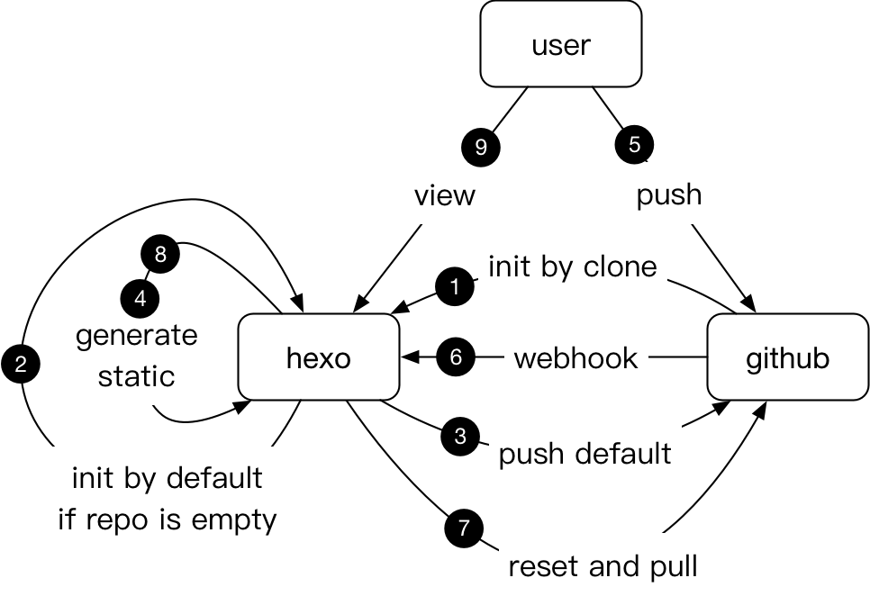
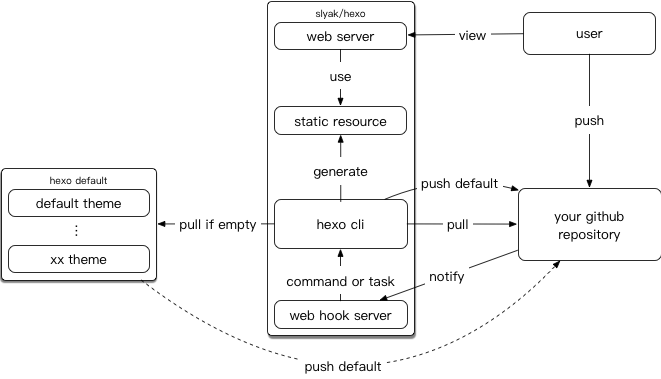
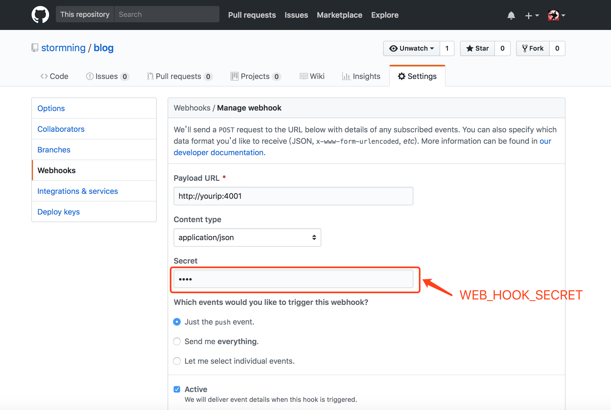
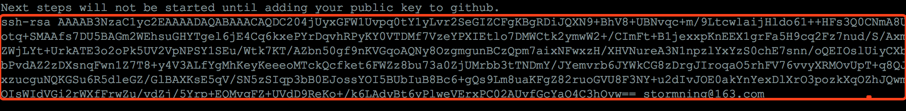
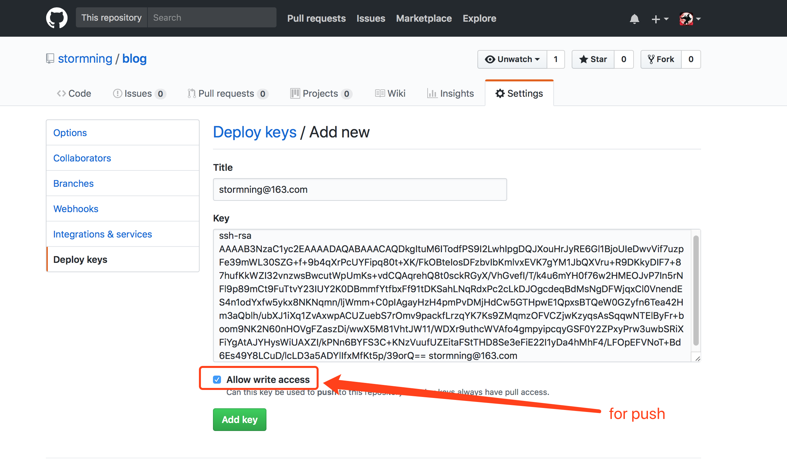

# slyak/hexo

## Architecture



1. Initialze your blog by cloning your github repository at the first time.
2. If the cloned repository is empty , we will use `hexo init` to init your bolg.
3. Push default hexo resources to your github repository.
4. Generate static web resources using command `hexo generate`.
5. We write some posts and push them to github.
6. Github notify the hexo server with the changes using webhook.
7. Webhook server receive event and reset repository and pull the latest sources from github .
8. Generate static web resources using command `hexo generate`.
9. We can see the changes without any delay.

That's all , all these things will be automatically done by this amazing docker image.

### logic architecture:



## Run hex server
### Preparations
1. Create a repository at github
2. Add webhook with payload url and secret


### Use nginx as web server
``` bash
curl -Ls https://raw.githubusercontent.com/stormning/env-tool-suite/master/software/hexo/hexo.conf \
    | sed "s|slyak.com|yourdomain|g" > /etc/nginx/conf.d/hexo.conf
service nginx restart
```
``` bash
docker run -idt -p 4001:4001 --name hexo \
    -e GIT_URL=your_blog_ssh_url \ 
    -e GIT_ACCOUNT=your_github_account \
    -e WEB_HOOK_SECRET=your_web_hook \ 
    -v /var/hexo:/var/hexo \
    slyak/hexo
```

### Or Use hexo default server
``` bash
docker run -idt -p 4000:4000 -p 4001:4001 --name hexo \
    -e GIT_URL=your_blog_ssh_url \ 
    -e GIT_ACCOUNT=your_github_account \
    -e WEB_HOOK_SECRET=your_web_hook \ 
    -v /var/hexo:/var/hexo \
    slyak/hexo hexo server
```

### Setup SSH key
``` bash
docker logs -f hexo
```

you will see:



copy the key to github , hexo server will continue to start.



### Environments and ports explanation

Docker run environments:

| Environment | Description |  Required  |
| --------    | :-----   | :----: |
| GIT_URL     | SSH url for github repository |   Y    |
| GIT_ACCOUNT | Your github account |   Y    |
| WEB_HOOK_SECRET | Github webook secret |   Y    |
| HEXO_HOME | Hexo home directory, default is `/var/hexo` |   N    |

Expose ports:

| Port | Description |
| --------    | :----- |
| 4000     | Hexo server port (if you use hexo's web server) |
| 4001 | Webhook server port |

