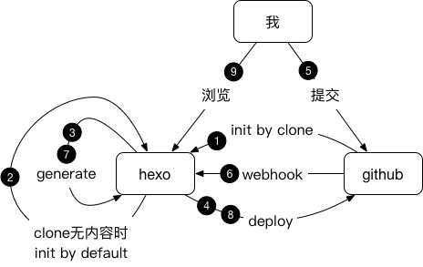

# hexo-github

1. Init your blog by setting `GIT_URL` by which we will clone your github repository at the first time.
2. If the cloned repository is empty , we will use `hexo init` to init your bolg.
3. Generate hexo by using command `hexo generate`.
4. Deploy hexo by using command `hexo deploy`.
5. We commit something to github.
6. Github notify the hexo server with the changes using webhook.
7. We receive changes and generate hexo again by using command `hexo generate` .
8. Deploy changes to github by using command `hexo deploy`.
9. We can see the changes without any delay.

That's all , all these things will be automatically done by this amazing docker image.

