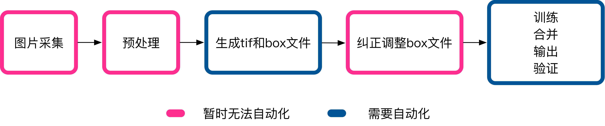

## slyak/tesseract
### 编写目的
> 使用tesseract进行图像训练一般需要如下步骤：

1. 采样需要识别的图片
2. 对采样的图片去噪，将像素点设置为黑色等预处理
3. 利用ImageMagick，将图片生成tiff
4. 利用jTessBoxEditor对tif进行merge，生成{字符集名称}.{字体名称}.exp{数字}.tif
5. 利用tesseract进行makebox生成box文件（如：tesseract zzbid.Arial.exp2.tif zzbid.Arial.exp2 -l eng -psm 7 batch.nochop makebox）
6. 利用jTessBoxEditor对生成的box文件进行编辑，利用split、insert、merge等纠正识别错误，保存box文件
7. 利用unicharset_extractor对单个box文件去重 `unicharset_extractor zzbid.Arial.exp1.box`
8. 利用tesseract进行box.train生成tr文件 `tesseract zzbid.Arial.exp1.tif zzbid.Arial.exp1 -l eng -psm 7  box.train`
9. 利用unicharset_extractor对多个box文件去重 `unicharset_extractor zzbid.Arial.exp1.box zzbid.Arial.exp2.box`
10. 定义font_properties文件 `echo 'Arial 0 0 0 0 0' > font_properties`
11. 聚类mftraining `mftraining -F font_properties -U unicharset -O zzbid.unicharset zzbid.Arial.exp1.tr zzbid.Arial.exp2.tr zzbid.Arial.exp3.tr zzbid.Arial.exp4.tr`
12. 聚类cntraining `cntraining zzbid.Arial.exp1.tr zzbid.Arial.exp2.tr zzbid.Arial.exp3.tr zzbid.Arial.exp4.tr`
13. 合并文件 `mv shapetable zzbid.shapetable && mv normproto zzbid.normproto && mv inttemp zzbid.inttemp && mv pffmtable zzbid.pffmtable && mv unicharset zzbid.unicharset && combine_tessdata zzbid.`
14. 把训练的lang文件放到lang目录（目录查看:tesseract --list-langs）
15. 验证训练文件`tesseract {图片} stdout -l zzbid`

**可见上述过程非常繁琐，所以我们需要将这个过程进行一部分自动化**

### 自动化的目标
暂时无法抽象和自动化的步骤包括1、2和6，我们可以将其分开，抽象为如下流程:

目标如下：

1. 提供tesseract运行环境
2. 将预处理过的图片自动生成tif和box文件
3. 自动训练、合并、输出训练库并进行验证
4. 提供图形化的操作界面

功能清单：

1. 语言库管理（列表、上传、下载）
2. 提供预处理后的文件管理（字体命名、文件上传），并根据这些文件生成对应tif和box文件
3. 可以下载生成的box，上传纠正过的box
4. box纠正之后会自动训练、合并、更新语言库
5. 对容器外对调用，提供图像识别RESTAPI（容器内使用SDK方式，tess4j）